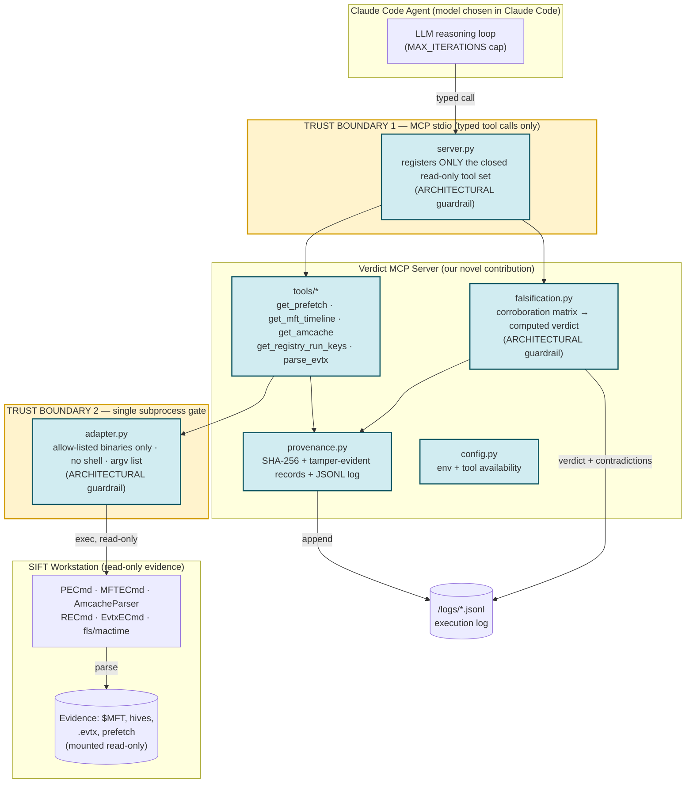

# Architecture & Trust Boundaries

Verdict sits between a Claude Code agent and the SIFT Workstation's forensic
tooling. It is deliberately the *only* path from the agent to the underlying
system, and that path is read-only by construction.

## System design

The agent only ever reaches evidence through the read-only MCP server. Findings
flow through the falsification engine (≥ 2 independent sources to confirm) and
the provenance layer before reaching the triage report.

### Detailed architecture & trust boundaries

Mermaid source for the diagram above

## Trust boundaries

| # | Boundary | What crosses it | Enforcement |
|---|----------|-----------------|-------------|
| 1 | Agent ↔ MCP server (stdio) | Only typed calls to the closed tool set in `READONLY_TOOLS` | **Architectural** — the server registers nothing else; `_assert_readonly_surface()` refuses to start if a forbidden tool name appears |
| 2 | Server ↔ operating system | Only allow-listed forensic binaries, as an argv list, `shell=False` | **Architectural** — `adapter.py` is the sole `subprocess` call site; non-allow-listed logical names raise before any process spawns |
| 3 | Server ↔ evidence | Read-only parsing only | **Architectural + operational** — wrappers only ever read; evidence should be mounted read-only on SIFT |

## Architectural vs prompt-based guardrails

This is the distinction the rubric asks us to be explicit about.

| Guardrail | Type | Why |
|-----------|------|-----|
| No shell/exec/write/delete tool exists | **Architectural** | The agent *cannot* call what is not registered. Not a request — a structural impossibility. |
| Subprocess allow-list, no shell, argv-only | **Architectural** | Enforced in code (`adapter.ALLOWED_TOOLS`, `shell=False`); shell metacharacters are inert data. |
| CONFIRMED requires ≥2 independent sources | **Architectural** | Verdicts are *computed* by `evaluate_claim`, not produced by the model's say-so. The model cannot mark something CONFIRMED. |
| Tamper-evident provenance on every output | **Architectural** | `record_id` is a hash of the record; `verify_record` detects mutation. |
| `MAX_ITERATIONS` runaway cap | **Architectural** | Enforced by the harness/agent loop, from config. |
| "Prefer corroborated findings; explain uncertainty" | **Prompt-based** | Helpful guidance to the agent, but *not* relied upon for safety — the architecture already enforces the outcome. |

The design principle: **safety-critical properties are architectural; prompt
guidance is only an ergonomic layer on top.** If the prompt were adversarially
ignored, the read-only and corroboration guarantees still hold.

## Data flow for a single finding

1. Agent calls `get_prefetch` / `get_amcache` / … → `adapter.py` runs the
   allow-listed binary read-only, captures + SHA-256 hashes the output, writes a
   provenance record to the JSONL log.
2. Wrapper normalizes the CSV into typed records tagged with `source_artifact`
   and `claim_type`.
3. Agent passes the collected outputs to `evaluate_findings`.
4. `falsification.py` builds cross-artifact claims (matching subjects across
   independent artifacts), computes a verdict, and logs the verdict + any
   contradiction.
5. Every reported finding is traceable through provenance IDs back to the exact
   tool execution that produced its evidence.
